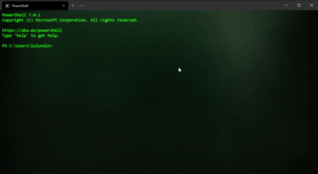

# Fallout Theme for the Windows Terminal



Updated for 2026.

## Installation

1. **Install Windows Terminal** from the [Microsoft Store](https://aka.ms/terminal) or from [GitHub](https://github.com/microsoft/terminal).
2. Open Windows Terminal and press `Ctrl` + `,` to open **Settings**.
3. In the bottom-left corner, click **Open JSON file** to open `settings.json` in your default editor.

> **Tip:** You can also open `settings.json` directly at:
> ```
> %localappdata%\Packages\Microsoft.WindowsTerminal_8wekyb3d8bbwe\LocalState\settings.json
> ```

First download the terminal background image, you can use any you find. Here is the one I am using:


4. Save `background.png` to `%localappdata%\Packages\Microsoft.WindowsTerminal_8wekyb3d8bbwe\RoamingState`.

5. Under your profile (`PowerShell`, `Ubuntu`, `Command Prompt`, etc.), add:

```json
{
    "guid": "{xxxxxxx-xxxx-xxxx-xxxx-xxxxxxx}",
    "hidden": false,
    "name": "PowerShell",
    "source": "Windows.Terminal.PowershellCore",
    "fontFace": "Lucida Sans Typewriter Regular",
    "experimental.retroTerminalEffect": true,
    "colorScheme": "Fallout",
    "backgroundImage": "ms-appdata:///roaming/background.png",
    "backgroundImageOpacity": 0.5,
    "backgroundImageStretchMode": "fill"
}
```

> Replace `guid`, `name`, and `source` with values matching your own profile.

6. Under `"schemes"`, add:

```json
{
    "name": "Fallout",
    "cursorColor": "#FFFFFF",
    "background": "#0C0C0C",
    "foreground": "#26E476",
    "selectionBackground": "#0C0C0C",
    "black": "#0C0C0C",
    "blue": "#26E476",
    "cyan": "#26E476",
    "green": "#022000",
    "purple": "#26E476",
    "red": "#26E476",
    "white": "#26E476",
    "yellow": "#26E476",
    "brightBlack": "#767676",
    "brightBlue": "#26E476",
    "brightCyan": "#26E476",
    "brightGreen": "#26E476",
    "brightPurple": "#26E476",
    "brightRed": "#26E476",
    "brightWhite": "#26E476",
    "brightYellow": "#26E476"
}
```

7. Save the file — Windows Terminal will automatically reload with the new theme.

## About `experimental.retroTerminalEffect`

The `"experimental.retroTerminalEffect": true` setting in the profile above enables a CRT-style visual effect (inspired by the [Microsoft Retro Command Prompt](https://learn.microsoft.com/en-us/windows/terminal/custom-terminal-gallery/retro-command-prompt)) that adds scan lines, screen glow, and subtle curvature distortion. You can disable it by setting the value to `false`.

You should be good to go!
